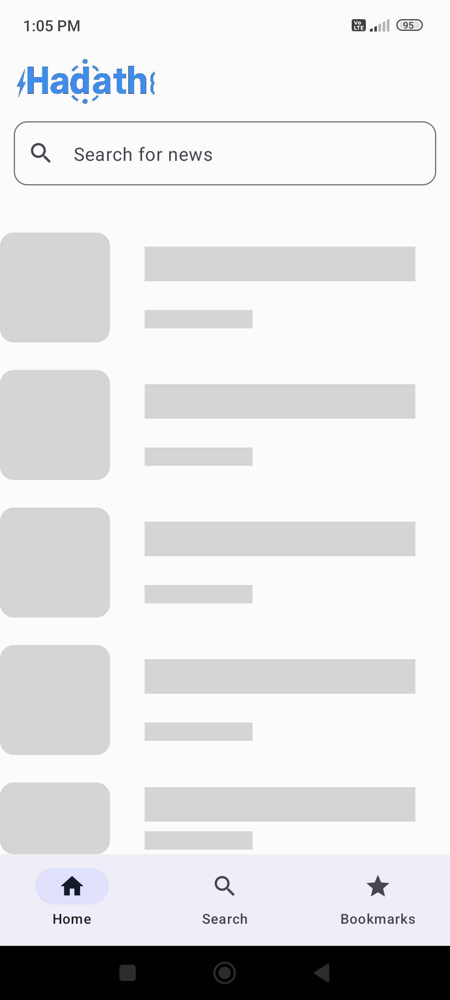
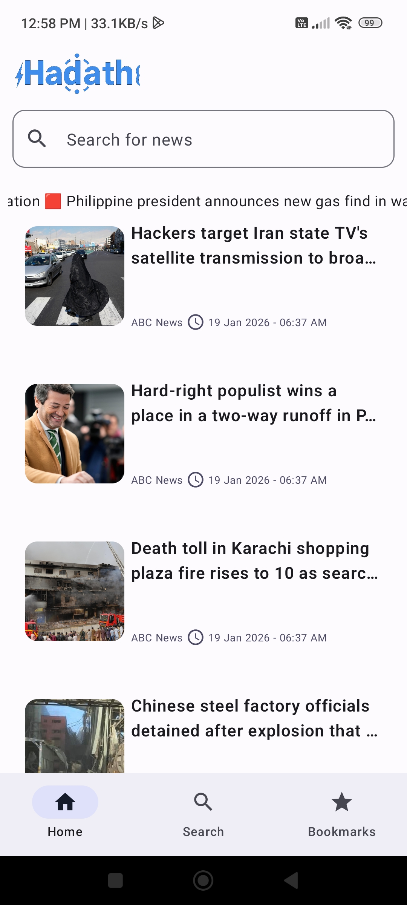
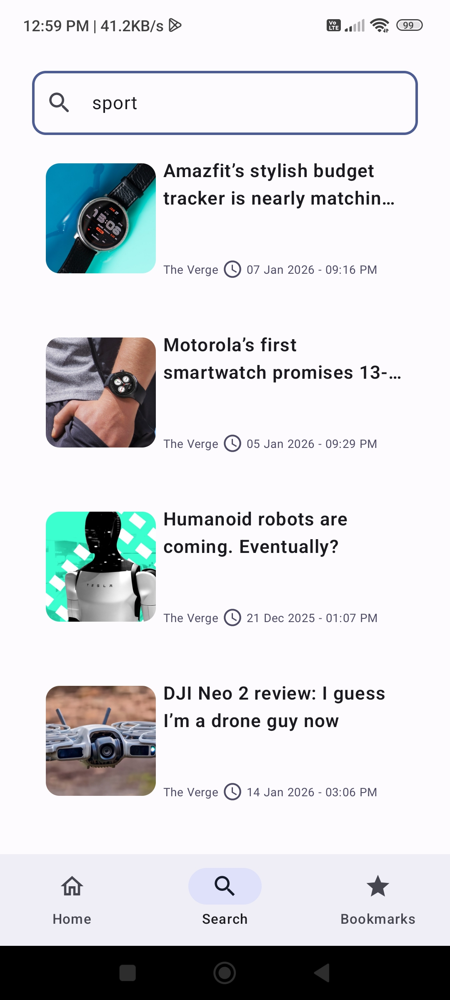
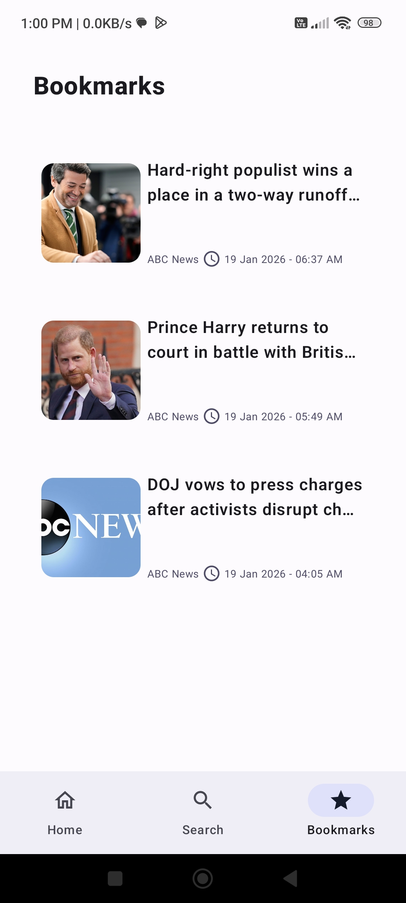

# 📰 Hadath (Android News App)

A modern Android news application built using **Kotlin** and **Jetpack Compose**, following **Clean Architecture** and **MVVM** principles.  
The app allows users to browse the latest news, search for articles, and read previously fetched content even when offline.

---

## ✨ Features
- Browse latest news articles
- Search news by keyword
- Pagination using Paging 3
- Fetch news from a REST API
- Offline caching using Room (previously fetched articles)
- App entry & onboarding state handled via DataStore
- Modern UI built with Jetpack Compose

---

## 🛠 Tech Stack
- **Language:** Kotlin  
- **UI:** Jetpack Compose  
- **Architecture:** Clean Architecture + MVVM  
- **Dependency Injection:** Hilt  
- **Networking:** Retrofit  
- **Pagination:** Paging 3  
- **Local Database:** Room  
- **Preferences:** DataStore  
- **Async:** Kotlin Coroutines & Flow  

---

## 🧱 Architecture

The project follows **Clean Architecture**, separating responsibilities into clear layers to improve scalability and maintainability.

```text
presentation/
├── UI (Jetpack Compose)
└── ViewModels

domain/
├── UseCases
├── Repository Interfaces
└── Domain Models

data/
├── Remote (API, PagingSource)
├── Local (Room, DAO)
└── DataStore

di/
```


---

## 🔄 Data Flow

```text
Remote API → Room
↓
Repository
↓
ViewModel
↓
Compose UI
```
- Data is fetched from the remote API  
- Articles are cached locally using Room  
- Cached articles are displayed when offline  

---

## 📸 Screenshots
<div>
   
   
   
   
   
   
   
   
</div>


## 🚀 Getting Started

### Prerequisites

- Android Studio (latest stable version)  
- Android SDK 24+  

### Setup

1. Clone the repository:
```bash
   git clone https://github.com/your-username/news-app.git
```

2. Open the project in Android Studio.

3. Add your API key to `local.properties`:
```properties
   NEWS_API_KEY=your_api_key_here
```

4. Build and run the app on an emulator or physical device.

---

## 🔐 API Key Security

The API key is **not hardcoded** in the source code.  
It is stored inside `local.properties` and accessed via `BuildConfig`, preventing accidental exposure when pushing the project to GitHub.

---

## 📌 Notes on Offline Caching

- The app caches previously fetched articles using Room  
- When the device is offline, cached data is displayed  
- No background sync or cache invalidation is implemented (by design for simplicity)

---

## 🔮 Future Improvements

- Add unit tests for ViewModels  
- Improve error and empty state handling  
- Implement smarter cache invalidation  
- UI animations & polish  

---

## 👨‍💻 Author

**Mostafa Al-Tuhami**  
Android Developer  
- GitHub: [mostafa-altuhami](https://github.com/mostafa-altuhami) 
- LinkedIn: [Mostafa Al-Tuhami](https://www.linkedin.com/in/mostafa-al-tuhami-152a09250?utm_source=share&utm_campaign=share_via&utm_content=profile&utm_medium=android_app)  

---

## ⭐ Support

If you like this project, consider giving it a ⭐ on GitHub!

---

## 📄 License
This project is licensed under the MIT License.
